Ever forget a deadline? Or lost track of your customers? Many commission-based artists struggle to organise
their business. With so many things to keep track of, you might have found yourself wondering if there were a
better way to manage all of these.

That's why we built **ArtBuddy** (AB), a commission-based artist's best buddy, just for you. Developed with your
needs in mind, ArtBuddy is here to help you manage all your customers and commissions in one place. But that's
not all. With integrated support for tracking the progress of your commissions through iterations,
and generation of statistics, ArtBuddy is also here to help you grow as an artist.

So, focus on your art and leave the rest to ArtBuddy.

Just getting started with ArtBuddy? We recommend you check out the [Using this guide](#using-this-guide) section
to.
Eager to get started? You can refer to our [Quick Start](#quick-start) section to set ArtBuddy up, or
you can jump right into our [Features](#features) section to learn more about the features ArtBuddy offers.

--------------------------------------------------------------------------------------------------------------------
# Table of Contents

1. Table of Contents
{:toc}

--------------------------------------------------------------------------------------------------------------------
# Using this guide

This guide walks you through all the features of ArtBuddy and can be used as a quick reference whenever you need any help.

If you're just getting started with ArtBuddy, we welcome you to start from our [Introduction](#introduction) section to
learn more about ArtBuddy. Or, if you're eager to hop right into setting up ArtBuddy, you might find the [Quick Start](#quick-start) section helpful.

Already set up ArtBuddy? You can check out our [Features](#features) section. For ease of reference, the
[Features](#features) section is divided into subsections corresponding to each main feature:
Customers, Commissions, Iterations and Statistics. Feel free to jump around as you explore ArtBuddy's amazing features!

You can also refer to our [Table of Contents](#table-of-contents) to navigate between the different sections of this guide.

### Conventions used in this guide

**Formatting conventions**  
As you read through this guide, you might come across text with special formatting. These specially formatted
text hold meaning, as described below. 

|                                    | Description                                                                                                                                                                                             |
|------------------------------------|---------------------------------------------------------------------------------------------------------------------------------------------------------------------------------------------------------|
| `code`                             | ArtBuddy commands appear in a monospaced font, with a grey background, as shown on the left. To learn more about ArtBuddy commands, refer to the [CLI section](#artbuddys-command-line-interface-cli).  |
| `CODE_UPPER_CASE`                  | Certain ArtBuddy commands contain words appear in upper case. These refer to [parameters]() (user input) to be supplied to ArtBuddy.                                                                    |
| <code><em>code_italics</em></code> | ArtBuddy commands may also contain words that appear in italics. These refer to example command [parameters](), which you can replace with your own inputs.                                             |
| [blue hyperlink]()                 | Hyperlinks appear in a blue font that is underlined when hovered over by your mouse. These hyperlinks bring you to another section of the user guide containing more relevant information to the topic. |
| **Bold Title Case**                | References to elements in ArtBuddy's [GUI]() (like buttons and text field labels) are formatted in **bold**, in Title Case.                                                                             |

**Conventions used in command formats**
When talking about ArtBuddy command formats, we've adopted the following conventions to make explanations
more succinct. If you're not familiar with ArtBuddy's CLI, you might want to look at our
[ArtBuddy's CLI](#artbuddys-command-line-interface-cli) section to learn more.

|                                                         | Description                                                                                                                                                                                                                                                    | Example                                                                                                                                                                                                                                                                                           |
|---------------------------------------------------------|----------------------------------------------------------------------------------------------------------------------------------------------------------------------------------------------------------------------------------------------------------------|---------------------------------------------------------------------------------------------------------------------------------------------------------------------------------------------------------------------------------------------------------------------------------------------------|
| Optional command parameters                             | Certain ArtBuddy commands have optional command parameters. These command parameters may be specified, or be left out. You'll be able to identify optional command parameters as they will appear around square brackets when specified in the command format. | For instance, the command format of the Add Customer command is `addcus n/NAME p/PHONE_NUMBER e/EMAIL [a/ADDRESS] [t/TAG]...`. Notice that the address and tag command parameters appear around square brackets? That just means that you can choose whether to specify these command parameters! |
| Command parameters that can be specified more than once | You may also notice that certain command have `...` after certain command parameters. This simply means indicates that the input parameter be used multiple times (including zero times).                                                                      | Following the example of the Add Customer example above, where you'll notice the tag command parameter `[t/TAG]...` is followed by `...`, this just means that the tag command input can be specified any number of times!                                                                        |

**Call-out text box conventions**  
You might also notice call-out text boxes in this guide. These contain additional information tidbits that might be useful
for you.

:information_source: **Note:** Call-outs like this contain information that you should know about ArtBuddy!

:bulb: **Tip:** Call-outs like this contain tips that you might find useful when using ArtBuddy.

:exclamation: **Caution:** Call-outs like this contain warnings that we recommend you read through to avoid
any unexpected behaviour of ArtBuddy.

--------------------------------------------------------------------------------------------------------------------
# Introduction

Made for commission-based artists, ArtBuddy is the easiest way to organise your customers and commissions.
Powerful features and intuitive design, all packaged into one neat desktop app. ArtBuddy is supported on all
major operating systems (Windows, macOS, Linux).

{: .no_toc}
#### Let ArtBuddy help you...

1. **Manage your customers**  
ArtBuddy lets you store, edit and delete your customer's information. Consolidate all your customer's
contact details, so you never have to lose a contact again.
2. **Take charge of your commissions**  
Add commissions to a customer in ArtBuddy, just like in real life! ArtBuddy can store your
commission details, like fees, deadlines, and completion statuses. Easily update and delete
commissions as you wish.
3. **Keep track of your progress**  
ArtBuddy wants you help you hone your craft, and learning from yourself is a critical part of that.
With ArtBuddy, keep track of the progress of your commissions using iterations. Each iteration is simply 
a version of your artwork. Learn from feedback and your past work, so you can continuously improve your craft.
4. **Supercharge your business**  
Learn where your highest sales are coming from by leveraging on the powerful statistics ArtBuddy offers
so that you can accelerate your business growth.

{: .no_toc}
#### Getting things done fast
We get that your time is precious. So spend it on what you love doing, your art, and let ArtBuddy handle the
rest. With optimised support for use via a Command Line Interface (CLI), ArtBuddy can help you manage your
small business at the speed of your fingertips.

Not sure what a CLI is? Don't worry! It's easy to pick up, you can even refer to our short introduction to
[ArtBuddy's CLI](#artbuddys-command-line-interface-cli) to learn more.

More of a visual person? Don't sweat it! Unlike many CLI applications, ArtBuddy still has a sleek, intuitive
[Graphical User Interface (GUI)](). This means that you can also interact with ArtBuddy using visual controls
like buttons and pop-ups. There's something for everyone!

--------------------------------------------------------------------------------------------------------------------
# Quick start

Let's get you started with ArtBuddy! This section will help you get oriented with ArtBuddy, from installation
to a quick tutorial. Users already experienced with CLI might want to skip over the CLI section. So, what are you
waiting for? Let's go, go, go!

[Installation instructions](#installation-instructions)  
[Starting up ArtBuddy](#starting-up-artbuddy)  
[Starting up ArtBuddy (on macOS)](#starting-up-artbuddy-macos)  
[Getting familiar with ArtBuddy's interface](#getting-familiar-with-artbuddys-interface)  
[ArtBuddy's CLI](#artbuddys-command-line-interface-cli)  
[Quick tutorial](#quick-tutorial)

### Installation instructions

Don't have ArtBuddy installed on your computer yet? Check out our step-by-step installation instructions to
download ArtBuddy.

1. ArtBuddy is written in the programming language Java, so you'll need **Java 11 or above** installed in your computer
to run ArtBuddy.
   1. Not sure if you have a compatible Java version installed on your computer?
   Windows or macOS users might find [this guide](https://blog.hubspot.com/website/check-java-verison) useful.
   While Linux users can refer to [this guide](https://phoenixnap.com/kb/check-java-version-linux).
   2. Don't have a compatible Java version installed? Fret not, Java is free to install! Complete installation
   instructions can be found [here](https://docs.oracle.com/en/java/javase/11/install/overview-jdk-installation.html).

2. Download the latest version of ArtBuddy by downloading the `artbuddy.jar` file found [here](https://github.com/AY2223S1-CS2103T-W11-3/tp/releases).

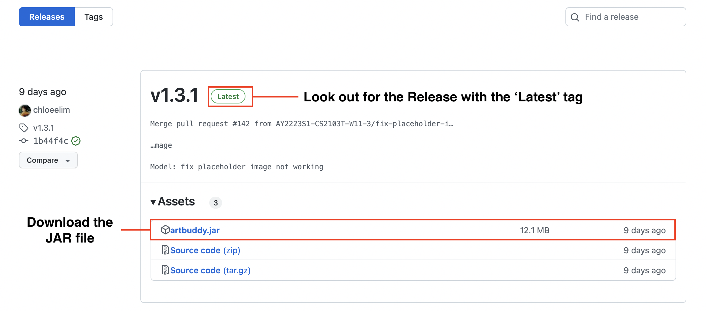

4. Create a new empty folder (with any name you like) in your computer where you'd like to store ArtBuddy.

5. Copy the downloaded ArtBuddy file (`artbuddy.jar`) into the new folder.

6. And...that's it! You now have ArtBuddy installed on your laptop!

### Starting up ArtBuddy

Nice! Now that you've downloaded ArtBuddy (if not, our [installation instructions](#installation-instructions)
might be useful), let's ArtBuddy up and running.

:exclamation: **Caution:** Due to the default privacy settings on macOS, certain features of ArtBuddy
may not work as expectedly. To avoid this, please refer to the section
[Starting up ArtBuddy (macOS)](#starting-up-artbuddy-macos) instead if you are a macOS user.

1. To start ArtBuddy, simply open up the folder where your downloaded `artbuddy.jar` file is and double-click the file to start the app.
2. And...ta-da! You should now see ArtBuddy running on your computer!

### Starting up ArtBuddy (macOS)

Due to the default privacy settings on macOS computers, ArtBuddy might not be able to read from or write to
files on your macOS computer. Because of this, some features like uploading images to ArtBuddy might not
work properly. To get ArtBuddy working properly on your macOS computer, follow these instructions instead
to get ArtBuddy up and running!

1. Locate the folder where your downloaded `artbuddy.jar` file is stored, and right click (or do a 2-finger press on
your Apple trackpad) on your folder. Click on the **Services** option in the menu that pops up.
2. This should reveal a **New Terminal at Folder** option, as shown below.

3. Click on the **New Terminal at Folder** option. You should see a Terminal window open. The Terminal is
just macOS's own CLI that will allow you to communicate with your macOS computer.
4. To let your computer know you want to run ArtBuddy, simply paste this command: `java -jar artbuddy.jar` into
the Terminal window and hit **return** on your keyboard.

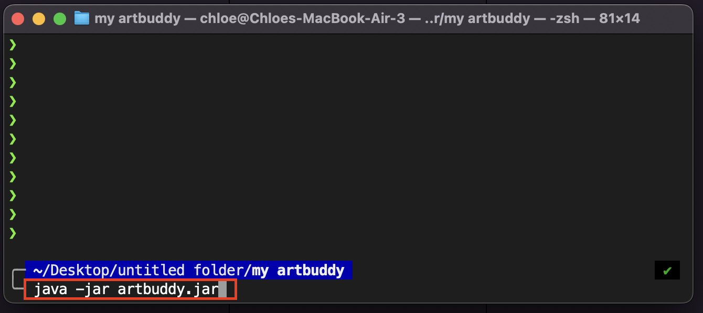

5. And...ta-da! You should now see ArtBuddy running on your computer!

### Getting familiar with ArtBuddy's interface

Cool! You now have gotten ArtBuddy up and running. Let's get you familiar with ArtBuddy's user interface.

ArtBuddy has two tabs: a **Customers Tab**, and a **Commissions Tab**. Let's take a closer look at each tab individually.

{: .no_toc}
#### Customers Tab

When you first open ArtBuddy, ArtBuddy will have the **Customers Tab** open by default. As its name implies,
the **Customers Tab** shows all your customer related information. Let's learn what each of these ArtBuddy components
in your **Customers Tab** does!

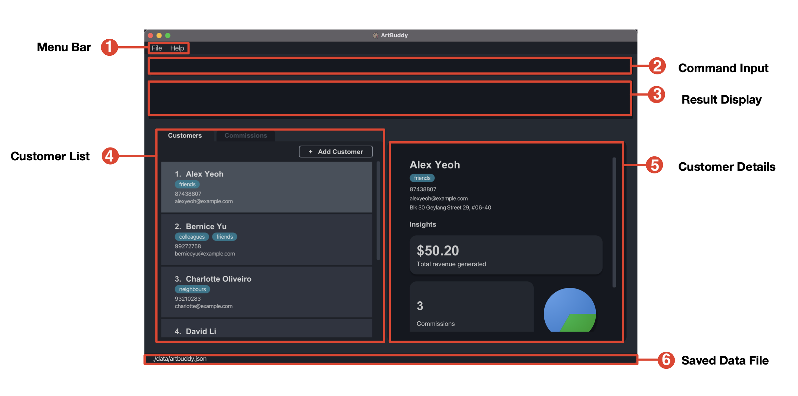

|     | Component        | Description                                                                                                                                                                                                 |
|-----|------------------|-------------------------------------------------------------------------------------------------------------------------------------------------------------------------------------------------------------|
| 1   | Menu Bar         | The menu bar contains menu options to [exit](#exiting-the-program-exit) from ArtBuddy and to get [help](#viewing-help-help).                                                                                |
| 2   | Command Input    | The command input is where you can key in your commands to tell ArtBuddy what you want to get done. To learn more about ArtBuddy's CLI, refer to the [next section](#artbuddys-command-line-interface-cli). |
| 3   | Result Display   | The result display is where you'll see ArtBuddy's replies to your commands.                                                                                                                                 |
| 4   | Customer List    | The default tab opened when you first start ArtBuddy is the customer tab. Notice how the **Customer** tab is highlighted? That indicates that ArtBuddy is currently showing you your list of Customers.     |
| 5   | Customer Details | When you select a customer from your **Customer List**, ArtBuddy will show you the details and statistics of your selected customer in this pane.                                                           |
| 6   | Saved Data File  | For advanced users, the [file path]() displayed here is where ArtBuddy stores your saved data (which you can [edit](#editing-the-data-file)).                                                               |

{: .no_toc}
#### Commissions Tab

Notice that ArtBuddy also has a **Commissions Tab**? When you navigate to the **Commissions Tab**, this is what you'll see.
As you might've already guessed it, ArtBuddy's **Commissions Tab** shows all commission-related information!

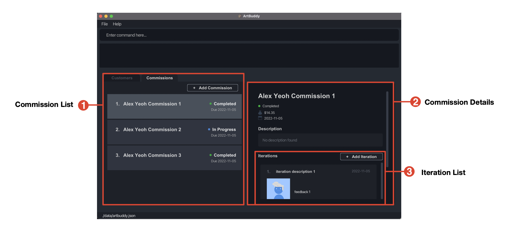

|     | Component          | Description                                                                                                                              |
|-----|--------------------|------------------------------------------------------------------------------------------------------------------------------------------|
| 1   | Commission List    | By default, all the commissions of your currently selected customer will be displayed in the Commission List here.                       |
| 2   | Commission Details | When you select a commission from your **Commission List**, ArtBuddy will show you the details of your selected commission in this pane. |
| 3   | Iteration List     | Within the **Commission Details** pane, ArtBuddy will also display all your commission's iterations here.                                |

### ArtBuddy's Command Line Interface (CLI)

ArtBuddy also has a Command Line Interface (CLI). This just means that besides interacting with ArtBuddy by
clicking on buttons, you can also tell ArtBuddy what you want to get done just by using text input (known as commands). Cool right?

Right now, ArtBuddy only understands certain commands (the complete list of commands can be found in
[Features](#features)). These commands must be formatted in a specific way. It's just the way ArtBuddy
is wired to think and listen to words. So let's learn how to talk to ArtBuddy!

**Command Input**  

The **Command Input** is where ArtBuddy's 'ears' are. This is the rectangular text input box outlined in red below.
To type in commands into the **Command Input**, just click on the **Command Input** and start typing away! Once you've
typed in your command, just press 'Enter' (or 'return' for Mac users) on your keyboard and... voilà!
ArtBuddy has just executed your command. It's that easy!

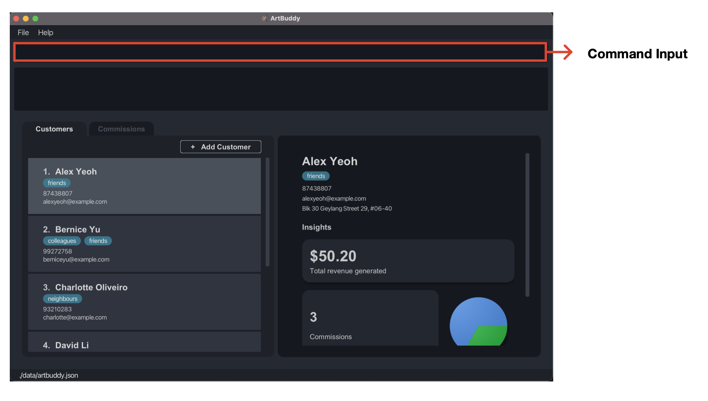

**ArtBuddy Commands**

An ArtBuddy command is typically made up of the following parts:

* **Command keyword**: This is the keyword that tells ArtBuddy exactly what command you wish to execute. All
ArtBuddy commands have a unique command keyword so ArtBuddy knows what you want to do.

* **Index**: Some ArtBuddy commands have an index, this simply a number that uniquely identifies the
Customer or Commission that you wish to execute your command on. A customer's or commission's index is
simply the number that appears beside your customer's name, or commission's title.

:exclamation: **Caution:** For ArtBuddy to understand what you mean, all ArtBuddy commands must begin
with their command keyword. Also, if an ArtBuddy command accepts an index, **the index must appear immediately**
after the command keyword.

* **Command parameters**: Some ArtBuddy commands also accept command parameters. These are just additional
inputs that ArtBuddy requires to execute some commands properly. For instance, to add a customer, ArtBuddy
needs to know the name of the customer which you'll need to pass into ArtBuddy as a command parameter.
  For ArtBuddy to understand these command parameters, you need to attach a 'prefix' in front of
each of these parameters. A 'prefix' is simply a single character with a forward slash (eg: "n/", "p/", "d/")
that lets ArtBuddy know what the piece of data you've passed into ArtBuddy is. With a prefix attached
to each command parameter, ArtBuddy now understands whether a command parameter is a customer's name, or a
customer's phone number. Neat right?

:information_source: **Notes about command parameters in ArtBuddy:** 

* When passing in dates in ArtBuddy as command parameters, they should be formatted in YYYY-MM-DD format.
  * This means that if you want to specify '4th October 2022' as a date command parameter, it should be
  formatted and passed into ArtBuddy as '2022-10-04'. 

* Something cool about ArtBuddy is that command parameters can be specified in any order! 
  * This means that if the command specifies `n/NAME p/PHONE_NUMBER`, ArtBuddy will also understand the
  input `p/PHONE_NUMBER n/NAME`.

* Also, if a parameter is expected only once in the command, but you specified it multiple times, ArtBuddy
will only listen to the last occurrence of the parameter.
  * So, if you specify <code>p/<em>12341234</em> p/<em>56785678</em></code>, only <code>p/<em>56785678</em></code> will be taken.

* In addition, if you specify command parameters for commands that do not take in parameters (such as `help`, `list`, `exit` and `clear`),
ArtBuddy simply ignore these extra parameters.
  * Meaning that the command <code>help <em>123</em></code>, will be interpreted as `help`.

### Quick tutorial
Itching to get started with ArtBuddy? Let's run you through some simple commands to get you warmed up
before you dive right into ArtBuddy's full feature list!

:information_source: Note that the images used in this section are only meant to be used as references.
ArtBuddy might appear differently on your computer because as the data shown in this sample reference may differ from
the data stored in your application.

Let's start by getting our hands cracking with some simple customer-related commands! Make sure the
[**Customer Tab**](#customers-tab) is open before trying out the following steps so you can observe what happens!

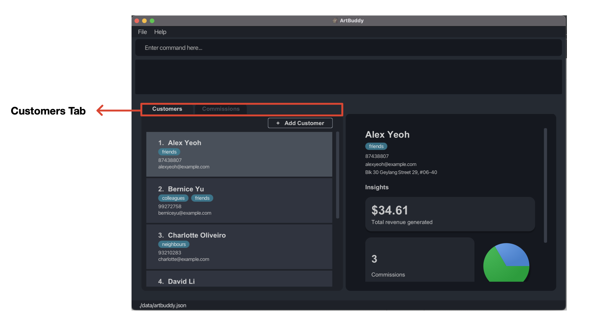

1. Suppose you've just received a new customer, Betsy, and you want to add her into ArtBuddy. Easy! Try
running the command <code>addcus n/Betsy Crowe e/betsycrowe@example.com p/1234586</code>.
   1. You'll notice that ArtBuddy has just created a new customer, Betsy Crowe!

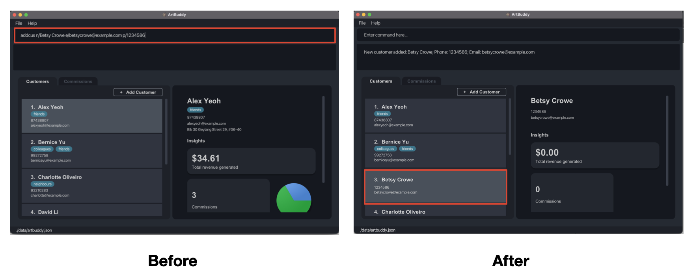 

2. Now suppose you want to delete a customer, Bernice, because she has decided to cancel her commission. This time, try
running <code>delcus 2</code>. 
   1. Ta-da! After executing the command, Bernice is now deleted from ArtBuddy.

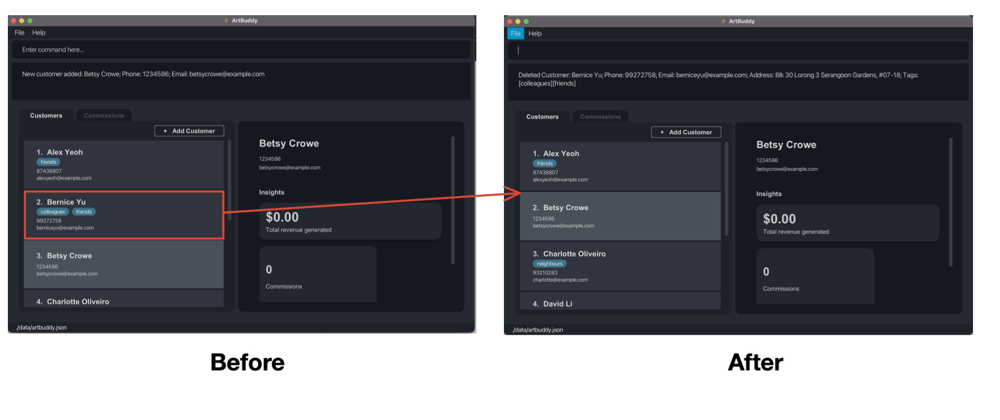

Now that you've been introduced to some customer-related commands, let's change things up by checking out some
commission commands.

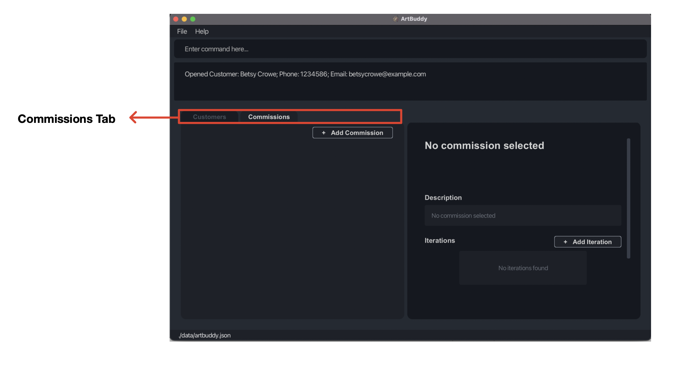

3. Suppose you want to manage Betsy's commissions. Let ArtBuddy know this by first 'opening' up Betsy's details in the
**Customers Tab**. You can do this by clicking on Betsy's entry in the **Customer List**, or by executing the command `opencus 2`.
   1. You should notice that Betsy's details appear in the **Customer Details** pane as shown below.

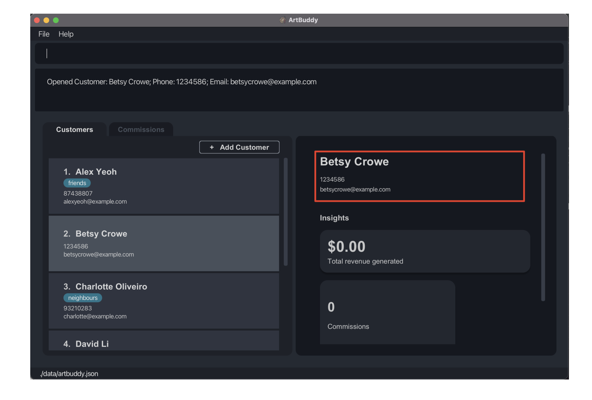

4. Now, switch to the **Commissions Tab** where all of Betsy's commissions are displayed. This tab should be empty
right now because Betsy has no commissions yet. Let's change that!

5. Try running the command <code>addcom n/Fate Archer f/60 d/2022-10-15 s/true p/Archery t/night t/city</code>.
   1. Nice! Betsy should now have a new commission titled "Fate Archer". You should also see the details of the newly
   created commission appear in the **Commission Details** pane.

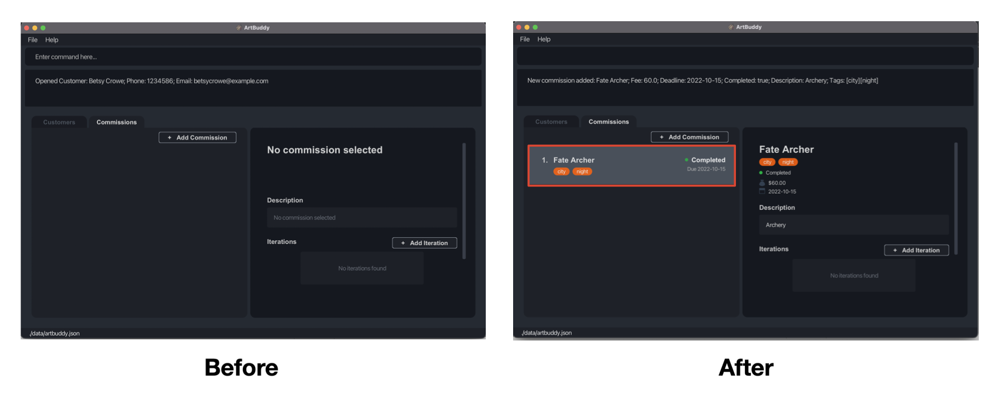

Good job! Now that you're getting the hang of things, check out our [Features](#features) section to explore the full
capabilities of ArtBuddy.

--------------------------------------------------------------------------------------------------------------------

# Features
Dive right into ArtBuddy's full list of features. This section guides you through all of ArtBuddy's commands.

For ease of reference, similar features are grouped into the individual subsections listed below:
* [Customer related commands](#customer-related-commands)
* [Commission related commands](#commission-related-commands)
* [Iteration related commands](#iteration-related-commands)
* [Statistical commands](#statistical-commands)
* [Miscellaneous](#miscellaneous)

## Customer related commands

Customers are at the heart of ArtBuddy. ArtBuddy will help you keep track of all your customers and their
details so you never have to lose a contact again.

Customers stored in ArtBuddy have the following details:

| Detail           | Explanation                                                                                                        |
|------------------|--------------------------------------------------------------------------------------------------------------------|
| Name             | The name of the customer                                                                                           |
| Phone number     | The phone number of the customer                                                                                   |
| Email            | The email of the customer                                                                                          |
| Optional address | The address of the customer (which is optional, a customer may not have recorded address)                          |
| Optional tags    | A customer may be tagged with any number of tags (including 0) which can be used to help categorise your customers |

ArtBuddy offers the following commands to help you manage your customers:
* [Viewing a customer: `opencus`](#viewing-a-customer-opencus)
* [Adding a customer: `addcus`](#adding-a-customer-addcus)
* [Editing a customer: `editcus`](#editing-a-customer-editcus)
* [Deleting a customer: `delcus`](#deleting-a-customer-delcus)

### Viewing a customer: `opencus`

Opens a customer at `INDEX` and shows customer details with various analytics you can use. The commissions tab will be updated to show the commissions made by the customer you selected. If no `INDEX` is provided, you will just switch to the customers tab.

Format: `opencus [INDEX]`

Examples:
* <code>opencus <em>2</em></code>
  Shows details about the customer and updates the commissions tab.

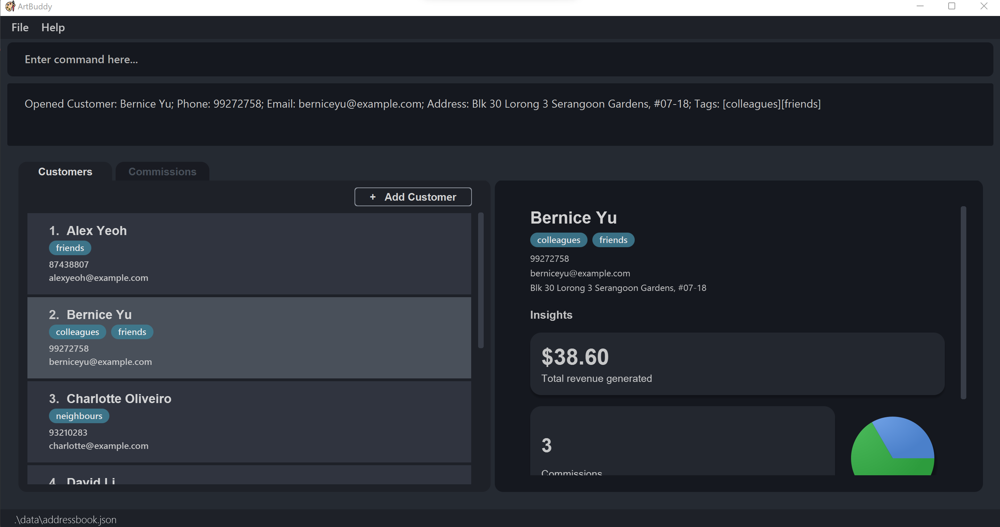

### Adding a customer: `addcus`

Adds a customer to ArtBuddy.

Format: `addcus n/NAME p/PHONE_NUMBER e/EMAIL [a/ADDRESS] [t/TAG]...​`

:bulb: **Tip:**
A customer can have any number of tags (including 0)

Examples:
* <code>addcus n/<em>John Doe</em> p/<em>98765432</em> e/<em>johnd@example.com</em> a/<em>John street, block 123, #01-01</em> t/<em>animal cartoons</em> t/<em>vip</em></code>
Creates the customer entry for John Doe with his details including multiple tags.
* <code>addcus n/<em>Betsy Crowe</em> e/<em>betsycrowe@example.com</em> p/<em>12345867</em></code>
Creates the customer entry for Betsy Crowe with her email and phone number.

### Editing a customer: `editcus`

Edits the details of the customer at `INDEX`.

Format: `editcus INDEX [n/NAME] [p/PHONE] [e/EMAIL] [a/ADDRESS] [t/TAG]...`
* At least one field to edit must be provided.

Examples:
* <code>editcus <em>1</em> p/<em>91234567</em> e/<em>johndoe@example.com</em></code> Edits the first customer's phone number and email.

### Deleting a customer: `delcus`

Deletes the customer at `INDEX` from the ArtBuddy.

Format: `delcus INDEX`

Examples:
* <code>delcus <em>2</em></code> Deletes the 2nd customer in the ArtBuddy and all commissions made by the customer.

## Commission related commands

A customer may ask for multiple commissions with different needs.
That is why we created the commission to help you keep track of all the commissions.

Commissions stored in ArtBuddy have the following details:

| Detail               | Explanation                                                                                                            |
|----------------------|------------------------------------------------------------------------------------------------------------------------|
| Title                | The name of the commission                                                                                             |
| Deadline             | The due date of the commission                                                                                         |
| Status               | The completion status of the commission                                                                                |
| Optional description | An optional description of the commission (for instance, the commission requirements)                                  |
| Optional tags        | A commission may be tagged with any number of tags (including 0) which can be used to help categorise your commissions |

ArtBuddy offers the following commands to help you manage your commissions:
* [Viewing a commission: `opencom`](#viewing-a-commission-opencom)
* [Adding a commission: `addcom`](#adding-a-commission-addcom)
* [Editing a commission: `editcom`](#editing-a-commission-editcom)
* [Deleting a commission: `delcom`](#deleting-a-commission-delcom)

### Viewing a commission: `opencom`

Opens a commission at `INDEX` and shows its relevant details and image. If no `INDEX` is specified, you will just switch to the commissions tab.

Format: `opencom [INDEX]`

Examples:
* `opencom` Switches to commissions tab.

* <code>opencom <em>2</em></code> When you run an `opencom` command with index <code>opencom <em>2</em></code>, you should be switched to the commissions tab to view commission details.

### Adding a commission: `addcom`

Adds a commission to the currently opened customer.

Format: `addcom n/TITLE f/FEE d/DEADLINE s/STATUS [p/DESCRIPTION] [t/TAG]...​`
* Fee is the amount you are charging the customer for this commission.
* Status states if the commission is done or not and can only take `y`, `yes`, `t`, `true` for complete status and `n`, `no`, `f`, `false` for incomplete status. It is case-insensitive.

Examples:
* <code>addcom n/<em>Rimuru</em> f/<em>40</em> d/<em>2022-11-01</em> t/<em>traditional</em> s/<em>Y</em> t/<em>chibi</em></code> creates the commission entry titled "Rimuru" with the given fee, due date, completion status and tags.
* <code>addcom n/<em>Fate Archer</em> f/<em>60</em> d/<em>2022-10-15</em> s/<em>false</em> p/<em>Archery</em> t/<em>night</em> t/<em>city</em></code> creates a commission entry titled "Fate Archer" with the given fee, due date, completion status, description and tags.

### Editing a commission: `editcom`

Edits a commission at `INDEX`.

Format: `editcom INDEX [n/TITLE] [f/FEE] [d/DEADLINE] [s/COMPLETION STATUS] [p/DESCRIPTION] [t/TAG]`
* At least one field to edit must be provided.

Example:
* <code>editcom <em>1</em> n/<em>Tokyo Ghoul Kaneki</em> f/<em>50</em> d/<em>2022-10-10</em> s/<em>False</em> p/<em>Unfamiliar, I will need to do up a reference board first.</em> t/<em>digital</em> t/<em>neon</em></code>
  Edits the first commission to have the above fields.
* <code>editcom <em>2</em> s/<em>True</em></code> Edits the second commission to be completed.

### Deleting a commission: `delcom`

Deletes a commission at `INDEX` and iterations related to the commission.

Format: `delcom INDEX`

Example:
* <code>delcom <em>14</em></code>

## Iteration related commands

Each piece of art represents a journey of growth. From ideation, sketches, drafts, to constant refinements.
ArtBuddy wants to help you capture this process. That's why we created iterations, just for you.

Each iteration serves as a 'bookmark', representing a version of your artwork as you work on perfecting your commission.

Iterations stored in ArtBuddy have the following details:

| Detail      | Explanation                                                                           |
|-------------|---------------------------------------------------------------------------------------|
| Description | Describes the progress that was made in the iteration                                 |
| Date        | Records the date tied to the iteration (for instance, when the iteration was created) |
| Image       | A picture that captures how the commission looks like in the current iteration        |
| Feedback    | Feedback attached to the current iteration (for instance, areas for improvement)      |

ArtBuddy offers the following commands to help you manage your iterations:
* [Adding iteration to a commission: `additer`](#adding-an-iteration-to-a-commission-additer)
* [Editing an iteration from commission: `edititer`](#editing-an-iteration-from-commission-edititer)
* [Deleting an iteration from commission: `deliter`](#deleting-an-iteration-from-commission-deliter)

### Adding an iteration to a commission: `additer`
Adds an iteration to the currently selected commission. This can be done either by the
[CLI](#adding-by-the-command-line-interface) or [GUI](#adding-by-graphical-interface).

##### Adding by the Command-Line Interface

Format: `additer n/DESCRIPTION d/DATE p/FILEPATH f/FEEDBACK`

* The file path specified should be an absolute path from your root directory. If you're not familiar with file paths
and root directories, you might find the explanation in the [Appendix](#what-are-file-paths-and-root-directories) helpful.
* The command requires a commission to be selected.
* Currently, only image file types .png, .jpg, .bmp and .gif are supported.

Example:
* <code>additer n/<em>First Draft</em> d/<em>2022-10-28</em> p/<em>/Users/John/Downloads/Draft 1.png</em> f/<em>Looks great</em></code> creates an iteration 
with the description "First Draft", date 28 October 2022, image at file path <code>p/<em>/Users/John/Downloads/Draft 1.png</em></code>, 
and feedback "Looks great".
  * Note that this example will probably not work for you because you'll need to replace the file path
  with a valid file path for the example to work.

:exclamation: **Caution:** There are some known limitations with specifying using the CLI. Please refer
to [Appendix: Limitations with file paths in CLI](#limitations-with-file-paths-in-cli) for more details.

 

##### Adding by Graphical Interface

1. Click on the **Add Iteration** button inside the Commission you wish to add the iteration to.

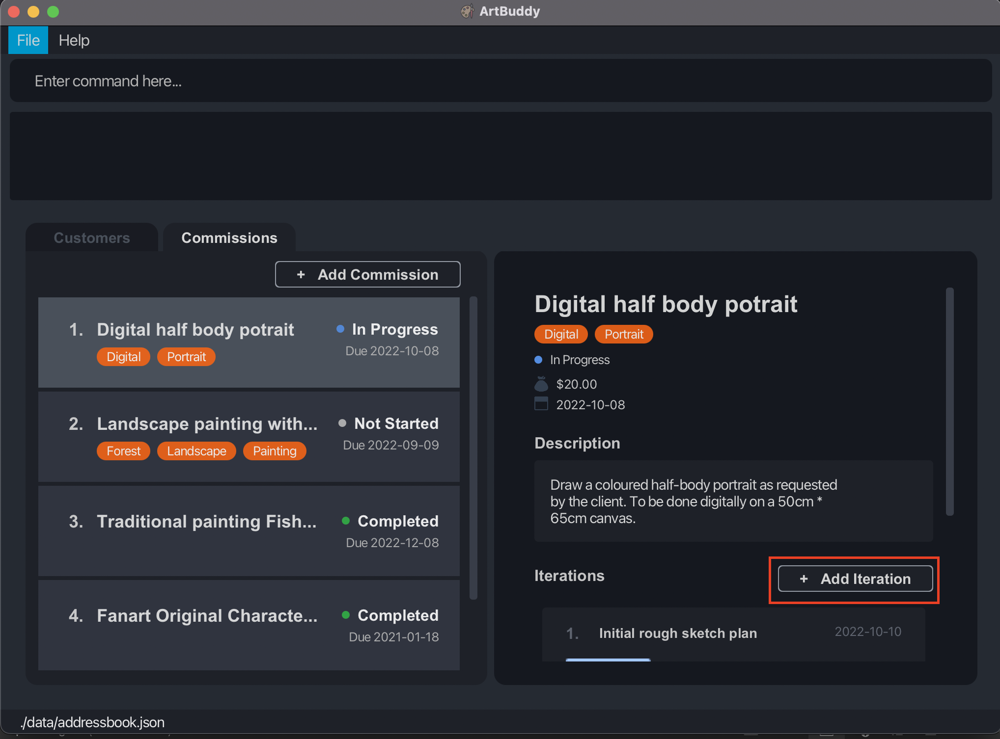

2. Fill in the details of the new iteration in the window that pops up.
   * An image can be added to the iteration by selecting a file in your file manager by clicking on the
   **Add Image** button, or by dragging and dropping an image to the grey image drop area.

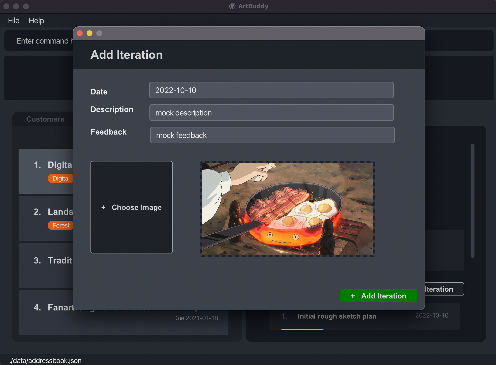

**:information_source: Notes about images in ArtBuddy:** 

ArtBuddy creates a copy of each file you upload. This means that you can edit, delete, or
move your original copy of the file without affecting the uploaded image on ArtBuddy.

### Editing an iteration from commission: `edititer`
Edits an iteration at `INDEX` in a commission.

Format: `edititer INDEX [n/DESCRIPTION] [d/DATE] [p/FILEPATH] [f/FEEDBACK]`
* The command requires a commission to be selected.
* At least one field to edit must be provided.

Example:
* <code>edititer <em>1</em> n/<em>Colourised image</em> d/<em>2022-10-12</em> f/<em>Good improvement</em> p/<em>/Users/John/Downloads/Updated Image.png</em></code>
  Edits the first iteration in the currently selected commission to have the above fields and image.
* <code>edititer <em>2</em> n/<em>Sketch</em></code> Edits the description of the second iteration in the currently selected commission.

### Deleting an iteration from commission: `deliter`
Deletes an iteration at `INDEX` from a commission.

Format: `deliter INDEX`
* The command requires a commission to be selected.
* You may want to note that your local copy of the image will not be deleted.

## Statistical commands

Supercharge your business with ArtBuddy's integrated statistical commands. It's now possible to leverage on your business data at the snap of your fingers. 

ArtBuddy offers the following commands to help you navigate through and make sense of all your data:
* [List all the customers: `list`](#list-all-the-customers-list)
* [Find a customer: `find`](#find-a-customer-find)
* [Sorting the customer list: `sortcus`](#sorting-the-customer-list-sortcus)
* [List the commissions: `listcom`](#list-the-commissions-listcom)
* [Viewing all commissions: `allcom`](#viewing-all-commissions-allcom)
* [Find a commission: `findcom`](#find-a-commission-findcom)

### List all the customers: `list`
Lists all the customers

Format: `list`

### Find a customer: `find`
Finds all the customers who satisfy keyword matching in the name and tag filters. The tag filter more specifically will include customers who contain all tags under `-all` and at least one of the tags under `-any`.

Format: `find [k/KEYWORDS]... -all [t/TAGS]... -any [t/TAGS]...`
* The keywords, all, and any filters are all optional and can be omitted, but at least one should exist.

Examples:
* <code>find k/<em>Kevin</em></code> Finds customers who have the name Kevin.
* <code>find -all t/<em>friend</em> t/<em>colleague</em></code> Finds customers who are tagged both `friend` and `colleague`.
* <code>find -any t/<em>friend</em> t/<em>colleague</em></code> Finds customers who are either tagged `friend` or `colleague`.

### Sorting the customer list: `sortcus`

Sorts the displayed customer list by one of the following options:

Prefix:
- `n` (name)
- `d` (latest commission date)
- `c` (commission count)
- `r` (revenue)
- `a` (active commissions count)

Suffix: `+` (increasing) or `-` (decreasing)

Format: `sortcus PREFIX/SUFFIX`

Examples:
* `sortcus n/+` Sorts the customer list from A to Z.

### List the commissions: `listcom`
Lists all the commissions made by selected customer.

Format: `listcom`

### Viewing all commissions: `allcom`

Displays all commissions across all customers in ArtBuddy.

Format: `allcom`

After running `allcom`, you should be switched to the commissions tab to view all commissions.
To view the commissions for a specific customer, return to the customer list ([`opencus`](#viewing-a-customer-opencus)) and select the customer from the list ([`opencus INDEX`](#viewing-a-customer-opencus)).

### Find a commission: `findcom`
Finds all the commissions in the list which satisfy keyword matching in the title and tag filters. The tag filter more specifically will include commissions which contain all tags under `-all` and at least one of the tags under `-any`.

Format: `findcom [k/KEYWORDS]... -all [t/TAGS]... -any [t/TAGS]...`
* The keywords, all, and any filters are all optional and can be omitted, but at least one should exist.

Examples:
* <code>findcom k/<em>Tree Painting</em></code> Finds commissions which have the title `Tree Painting`.
* <code>find -all t/<em>oil painting</em> t/<em>canvas</em></code> Finds commissions which are tagged both `oil painting` and `canvas`.
* <code>find -any t/<em>oil painting</em> t/<em>canvas</em></code> Finds commissions who are either tagged `oil painting` or `canvas`.

## Miscellaneous

### Viewing help: `help`

Shows you a message explaining how to access the help page.

Format: `help`
 
### Clearing all the customers: `clear`
Clears all your customers from ArtBuddy, including their commissions and iterations.

:exclamation: **Caution:**
This command cannot be undone. So only execute this command when you are 100% sure of executing it.

### Exiting the program: `exit`

Exits the program.

Format: `exit`

--------------------------------------------------------------------------------------------------------------------

# Appendix

### Saving the data

ArtBuddy data are saved in the hard disk automatically after any command that changes the data. There is no need to save manually.

### Editing the data file

ArtBuddy data are saved as a JSON file `[JAR file location]/data/artbuddy.json`. Advanced users are welcome to update data directly by editing that data file.

:exclamation: **Caution:**
If your changes to the data file makes its format invalid, ArtBuddy will discard all data and start with an empty data file at the next run.

### Limitations with file paths in CLI
Due to file path naming and the command format, specifying a folder with a folder name that ends with a
**'n', 'd', 'f', or 'p'** would lead to an ambiguous command.

For instance, the command `additer d/2022-10-10 n/description f/actual feedback p//test f/image.png` is ambiguous
because ArtBuddy does not know whether <code>f/<em>image.png</em></code> is the feedback parameter specified by the user.

If you wish to upload the image, either rename the folder name, or [upload the image by the GUI]().

### What are file paths and root directories?
Just like how we use addresses to tell specify locations when talking to people, computers
do the same! Each file in your computer has a unique address that can be used to identify the
exact location in your computer where the file is stored.

The address of each file in your computer can be viewed simply as "directions", guiding your
computer to get to the file. Think about how you would tell someone how to open a specific file
in your computer. You would probably say something along the lines of: "Go to the Downloads folder,
where you'll find an  Image folder. Click into the Images folder and open the file Draft1.png".

Well to computers, file paths are just like these guiding instructions that help them locate
a specific file! And your 'root directory' is simply a 'base point' that stores all your files in
your computer. For most users using a Windows or Mac computer, this root directory is simply
a folder named `/`.

So what a file path `/Users/John/Downloads/Draft 1.png` really means is just a way of telling
the computer, "Hey, from my root directory, you'll find a folder called Users, and in there a
folder called John. Open that up and you'll find another folder called Downloads.
Open the Downloads folder and you'll see the file I want called `Draft 1.png`".

To easily copy a filepath of a file:
* On Windows, in your File Explorer, hold shift down while you right-click on the file you want. Select the option <code>Copy as Path</code> and the filepath of your file will be copied!
* On Mac, in your Finder, click on the file you want to select it and press the <code>Option</code>, <code>Command</code>, <code>C</code> keys simultaneously. The filepath of your file is now copied!

--------------------------------------------------------------------------------------------------------------------

# FAQ

**Q**: How do I transfer my data to another Computer? 
**A**: Install the app in the other computer and overwrite the empty data file it creates with the file that contains the data of your previous ArtBuddy home folder.

--------------------------------------------------------------------------------------------------------------------

# Command summary

| Action                   | Format, Examples                                                                                                                                                                                                                                                                                                                      |
|--------------------------|---------------------------------------------------------------------------------------------------------------------------------------------------------------------------------------------------------------------------------------------------------------------------------------------------------------------------------------|
| **Help**                 | `help`                                                                                                                                                                                                                                                                                                                                |
| **Open customer**        | `opencus INDEX`  e.g., <code>opencus <em>2</em></code>                                                                                                                                                                                                                                                                             |
| **Add customer**         | `addcus n/NAME p/PHONE_NUMBER e/EMAIL [a/ADDRESS] [t/TAG]...`    e.g., <code>addcus n/<em>John Doe</em> p/<em>98765432</em> e/<em>johnd@example.com</em> a/<em>John street, block 123, #01-01</em> t/<em>animal cartoons</em></code>                                                                                               |
| **Edit customer**        | `editcus INDEX [n/NAME] [p/PHONE] [e/EMAIL] [a/ADDRESS] [t/TAG]...`   e.g., <code>editcus <em>1</em> p/<em>91234567</em> e/<em>johndoe@example.com</em></code>                                                                                                                                                                     |
| **Delete customer**      | `delcus INDEX`  e.g., <code>delcus <em>14</em></code>                                                                                                                                                                                                                                                                              |
| **Open Commission**      | `opencom INDEX`  e.g., <code>opencom <em>14</em></code>                                                                                                                                                                                                                                                                            |
| **Add commission**       | `addcom n/TITLE f/FEE d/DEADLINE [t/TAG]...`  e.g., <code>addcom n/<em>Rimuru</em> f/<em>40</em> d/<em>2022-11-01</em> t/<em>traditional</em> t/<em>chibi</em></code>                                                                                                                                                              |
| **Edit commission**      | `editcom INDEX [n/TITLE] [f/FEE] [d/DEADLINE] [s/COMPLETION STATUS] [p/DESCRIPTION] [t/TAG]...`   e.g., <code>editcom <em>1</em> n/<em>Tokyo Ghoul Kaneki</em> f/<em>50</em> d/<em>2022-10-10</em> s/<em>False</em> p/<em>Unfamiliar, I will need to do up a reference board first.</em> t/<em>digital</em> t/<em>neon</em></code> |
| **Delete Commission**    | `delcom INDEX`  e.g., <code>delcom <em>14</em></code>                                                                                                                                                                                                                                                                              |
| **Add Iteration**        | `additer n/DESCRIPTION d/DATE f/FEEDBACK p/FILEPATH`  e.g., <code>additer n/<em>Draft 1</em> f/<em>Good</em> d/<em>2022-10-28</em> p/<em>/Users/John/Downloads/Bread.jpeg</em></code>                                                                                                                                              |
| **Edit Iteration**       | `edititer INDEX [n/DESCRIPTION] [d/DATE] [f/FEEDBACK] [p/FILEPATH]`  e.g, <code>edititer <em>2</em> n/<em>Sketch</em></code>                                                                                                                                                                                                       |
| **Delete Iteration**     | `deliter INDEX`  e.g., <code>deliter <em>1</em></code>                                                                                                                                                                                                                                                                             |
| **List customers**       | `list`                                                                                                                                                                                                                                                                                                                                |
| **Find customers**       | `find [k/KEYWORD]... -all [t/TAG]... -any [t/TAG]...`   e.g. <code>find -all t/<em>friend</em> t/<em>colleague</em></code>                                                                                                                                                                                                         |
| **Sort customers**       | `sortcus PREFIX/SUFFIX`  e.g., <code>sortcus n/<em>+</em></code>                                                                                                                                                                                                                                                                   |
| **List commissions**     | `listcom`                                                                                                                                                                                                                                                                                                                             |
| **View all Commissions** | `allcom`                                                                                                                                                                                                                                                                                                                              |
| **Find commissions**     | `findcom [k/KEYWORD]... -all [t/TAG]... -any [t/TAG]...`                                                                                                                                                                                                                                                                              |
| **Clear everything**     | `clear`                                                                                                                                                                                                                                                                                                                               |
| **Exit**                 | `exit`                                                                                                                                                                                                                                                                                                                                |
